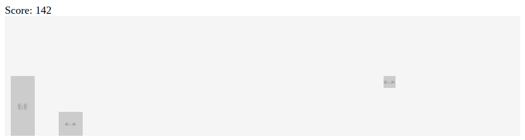

# DinoDemo

DinoDemo is an intentionally oversimplified remake of the google chrome dinosaur game for teaching javascript basics to a middle school level audience. It has all the basics aspects of the chrome dinosaur game such as:

 - jumping and squatting (up and down arrow keys)
 - both cacti and pterodactyl-like obstacles
 - score keeping
 - messages upon death

The game is implemented in simple client-side javascript with only basic HTML, CSS, and javascript and placeholder images.

Some ideas for things that can be added to this are:

 - make ducking last for as long as the arrow key is held down
 - change the game to accept different keys, such as space, click, or W to jump, and S to squat
 - change the images (or create your own) to be the dinosaur/cacti .etc
 - add new obstacles